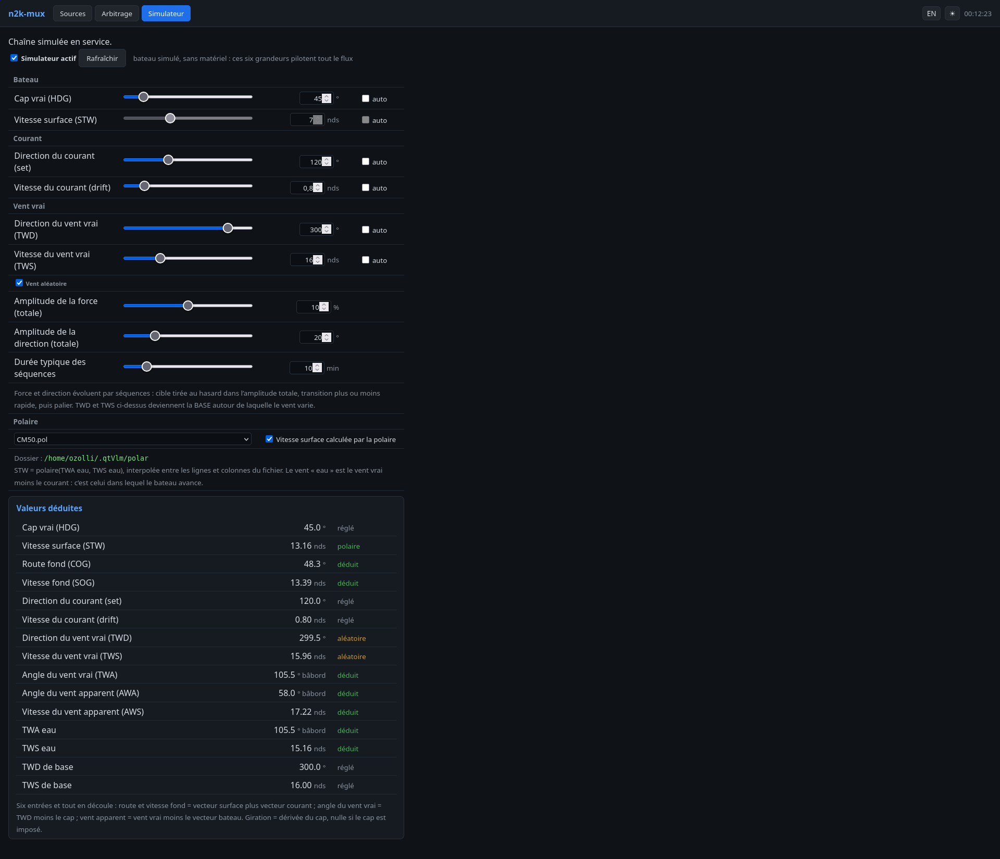

# n2k-mux — mode d'emploi

[English](README.md) · **Français**

`n2k-mux` lit le réseau **NMEA 2000** du bord, choisit **la meilleure source**
pour chaque donnée (position, cap, vent, profondeur, AIS…) et la redistribue à vos
logiciels de navigation, **en NMEA 2000** (pour qtVlm) **et en NMEA 0183** (pour
les tablettes et le legacy).

Une fois installé, vous disposez de quatre points de connexion :

| Vous voulez… | Connectez-vous à | Format |
|---|---|---|
| qtVlm **sur le PC de bord** (local) | interface **`vcan0`** (socketcan) | N2K natif |
| qtVlm **en réseau** (N2K) | `hôte:2700` (source NMEA **TCP**) | YDRAW |
| Tablettes / qtVlm en **NMEA 0183** | `hôte:10110` (TCP, + UDP) | 0183 |
| **Administrer** (config, équipements, charge, simulateur) | `http://hôte:8080/` | Web |

> Montage recommandé : PC de bord (Linux) relié au bus N2K par un **adaptateur
> socketcan** (PEAK PCAN-USB FD…). Une passerelle série **Actisense NGX-1/NGT-1**
> reste supportée (voir [§2.4](#24-variante-passerelle-série-ngx-1)). Pour essayer
> **sans matériel**, voir le [§7 Banc de test](#7-banc-de-test-sans-matériel).

---

## Sommaire

1. [Comment ça marche](#1-comment-ça-marche)
2. [Installation](#2-installation)
3. [Configurer votre bord](#3-configurer-votre-bord)
4. [Brancher qtVlm et les tablettes](#4-brancher-qtvlm-et-les-tablettes)
5. [Administrer par le web](#5-administrer-par-le-web)
6. [Dépannage](#6-dépannage)
7. [Banc de test sans matériel](#7-banc-de-test-sans-matériel)
8. [Annexes](#8-annexes) — options, PGN convertis, modes d'arbitrage, tests

---

## 1. Comment ça marche

Avec un adaptateur socketcan (montage par défaut) :

```
Bus NMEA 2000 ── adaptateur CAN (PEAK) ── can0
   │
   ├─► n2k-filter ──┬─► vcan0       (N2K local : qtVlm sur le PC de bord)
   │  (ne réémet que │
   │   les trames    └─► TCP 2700   (N2K réseau YDRAW : qtVlm distant)
   │   retenues)
   │
   └─► candump → analyzer → n2k-mux ──► kplex ──► TCP 10110 + UDP   (0183 → tablettes)
        (décode, résout les identités,  └─► n2k-mux --ais-json → n2kd (AIS → !AIVDM)
         arbitre, publie les « perdants »)
```

Les idées clés :

- **Identité stable.** Les équipements sont suivis par leur numéro de série
  (*Model Serial Code*), pas par leur adresse N2K. Vos priorités survivent donc à
  un changement d'adresse sur le bus.
- **Arbitrage par donnée.** Pour chaque type de mesure vous listez les sources
  préférées ; n2k-mux prend la première **vivante** (bascule automatique si elle se
  tait). Modes spéciaux : `min` (profondeur, sécurité), `max` (loch), `fusion`
  (AIS dédupliqué par MMSI).
- **Filtre N2K→N2K (frame-passthrough).** La couche *décision* (`n2k-mux`) désigne,
  par PGN, la source retenue et publie la liste des **perdants** ; `n2k-filter`
  recopie sur `vcan0`/TCP 2700 **uniquement les trames brutes retenues**, sans
  ré-encodage. `vcan0` est donc un bus N2K **propre, déjà arbitré** (un seul GPS,
  une seule position…) que `can0` n'est pas.
- **0183 dérivé** (kplex) pour les tablettes et le legacy, AIS encodé par `n2kd`.
- **Charge du bus mesurée** sur les vraies trames CAN (pas une estimation).
- **Tout en C11, sans dépendance** hors libc (et `canboat` pour le décodage/AIS).

> Avec une passerelle série NGX-1, le principe est le même mais l'entrée passe par
> `actisense-serial` au lieu de socketcan (cf. §2.4) ; la sortie N2K réseau est
> alors fournie par `ydraw-bridge`.

---

## 2. Installation

### 2.1 Prérequis

- Linux, `gcc` (ou `clang`), `make`.
- [canboat](https://github.com/canboat/canboat) compilé : `analyzer`, `n2kd`,
  `candump2analyzer` (et `actisense-serial` si passerelle série).
- `can-utils` (`candump`) pour la voie socketcan : `sudo apt install can-utils`.
- `kplex` pour la sortie 0183 — **absent des dépôts Debian / Raspberry Pi OS**,
  à compiler depuis les sources (C pur, sans dépendances) :
  `git clone https://github.com/stripydog/kplex && cd kplex && make && sudo make install`
  (s'installe dans `/usr/bin/kplex`).
- **Au choix** : un adaptateur **socketcan** (PEAK PCAN-USB FD…) relié au bus N2K
  (recommandé) **ou** une passerelle **NGX-1/NGT-1 en mode Transfer** (N2K brut).

### 2.2 Compiler

```sh
git clone https://github.com/ozolli/n2k-mux && cd n2k-mux
make          # daemon + filtre + UI web + ydraw-bridge + simulateur + testeurs
```

Vérifier que tout est sain — une commande, un seul code de sortie (voir §8.3) :

```sh
make test
```

### 2.3 Installer le service (socketcan, recommandé)

```sh
sudo make install
```

Cela installe les binaires dans `/usr/local/bin` (`n2k-mux`, `n2k-filter`,
`n2k-mux-web`, scripts et `ydraw-bridge`), les services systemd et des fichiers
d'exemple. Préparez la configuration :

```sh
sudo cp /etc/n2k-mux/n2k-mux.ini.example /etc/n2k-mux/n2k-mux.ini
sudo cp /etc/default/n2k-mux.example     /etc/default/n2k-mux       # réglages
sudo cp kplex.conf.example               /etc/kplex.conf
$EDITOR /etc/n2k-mux/n2k-mux.ini   # voir §3
```

Dans **`/etc/default/n2k-mux`**, indiquez l'interface CAN et le chemin des binaires
canboat s'ils ne sont pas dans le `PATH` :

```sh
CANIF=can0                 # interface de l'adaptateur (montée à 250 kbit/s par le service)
VCANIF=vcan0               # CAN virtuel pour le flux arbitré local
YDRAW_PORT=2700            # flux N2K arbitré servi en YDRAW/TCP (qtVlm réseau)
ANALYZER=/home/vous/canboat/rel/linux-x86_64/analyzer
N2KD=/home/vous/canboat/rel/linux-x86_64/n2kd
CANDUMP2ANALYZER=/home/vous/canboat/rel/linux-x86_64/candump2analyzer
WEB_AUTH=admin:choisir-un-mot-de-passe   # OBLIGATOIRE : l'UI web écoute sur le LAN
```

> **`WEB_AUTH` est obligatoire** avec le service par défaut : `n2k-mux-web` écoute
> sur le LAN (`BIND=0.0.0.0`) et **refuse de démarrer** sans authentification,
> puisque l'interface écrit la config. Sinon, posez `BIND=127.0.0.1` pour un accès
> local seulement (voir §5).

Désactivez un éventuel ancien service `kplex` autonome (il entrerait en conflit),
puis démarrez :

```sh
sudo systemctl disable --now kplex 2>/dev/null || true
sudo systemctl daemon-reload
sudo systemctl enable --now n2k-mux-can n2k-mux-web
```

Le service **monte `can0` (250 kbit/s) et `vcan0` au démarrage**, lance la chaîne
(filtre + décision + kplex + n2kd), redémarre tout seul en cas de défaillance d'un
maillon (`Restart=always`) et au boot. Vérifier :

```sh
systemctl is-active n2k-mux-can n2k-mux-web   # → active / active
journalctl -u n2k-mux-can -f                  # suivre les logs
```

### 2.4 Variante passerelle série (NGX-1)

Sans adaptateur socketcan, utilisez la passerelle **NGX-1/NGT-1 en mode Transfer**
et le service **`n2k-mux`** (au lieu de `n2k-mux-can` — ne pas activer les deux).
Réglez `DEVICE`/`BAUD` et `ACTISENSE` dans `/etc/default/n2k-mux`, puis :

```sh
sudo systemctl enable --now n2k-mux n2k-mux-web
```

La chaîne est `actisense-serial → analyzer → n2k-mux → kplex` ; la sortie N2K
réseau (TCP 2700) est fournie par `ydraw-bridge` (branche optionnelle du script
`n2k-mux-run`). Le NGX-1 doit être en mode **Transfer** (N2K brut), **pas** Convert.

### 2.5 Raspberry Pi + PiCAN (HAT CAN SPI)

Une carte PiCAN (SK Pang, MCP2515) présente le bus comme socketcan `can0` : la
chaîne `n2k-mux-can` tourne sans modification. Seule étape spécifique au Pi :
activer l'overlay device-tree pour que le driver crée `can0`. Dans
`/boot/firmware/config.txt` (`/boot/config.txt` sur les OS plus anciens) :

```
dtparam=spi=on
dtoverlay=mcp2515-can0,oscillator=16000000,interrupt=25
```

Le PiCAN2 utilise un quartz **16 MHz** et **GPIO25** pour l'interruption (à
confirmer sur votre carte). Un **PiCAN FD** (MCP2518FD) utilise plutôt
`dtoverlay=mcp251xfd,...`. Redémarrez, puis `ip -br link show can0` doit lister
l'interface (état DOWN normal — le service la monte à 250 kbit/s et crée `vcan0`).
Ensuite, suivez le §2.3 (`enable --now n2k-mux-can n2k-mux-web`).

> **Terminaison** : le PiCAN a un cavalier de terminaison 120 Ω. Un backbone NMEA
> 2000 est déjà terminé aux deux bouts — **laissez le cavalier ouvert**. Ne
> l'activez que si le Pi est en bout de bus non terminé. Alimentez le Pi à part,
> pas par le bus.

### 2.6 HALPI2 / ordinateurs de bord intégrés

Le **HALPI2** de Hat Labs (Raspberry Pi CM5, interface NMEA 2000 isolée) expose
directement le bus en socketcan `can0` via son image `halpi2-firmware` — **aucun
overlay device-tree à ajouter** (sautez le §2.5). Son nœud CAN est isolé et n'est
pas un bout de bus : pas de cavalier de terminaison à gérer. Installez simplement
canboat + kplex + can-utils, puis `make install` et `enable --now n2k-mux-can
n2k-mux-web` comme au §2.3. Idem pour tout ordinateur de bord présentant déjà le
bus en `can0`.

---

## 3. Configurer votre bord

La configuration est un fichier INI (`/etc/n2k-mux/n2k-mux.ini`). Modèle complet
commenté : `n2k-mux.ini.example`.

```ini
[output]
talker = II                 ; talker des phrases 0183 (qtVlm l'ignore)
no_0183 = 129291            ; pas de phrase VDR : qtVlm la rejette (voir §8.2)

[sources]
; nom logique = Model Serial Code (ou Unique Number) de l'équipement
SCX = 4830123               ; Furuno SCX-20 (cap/attitude/position)
VER = 917661                ; Veratron GO (GPS)
DH  = 000A520AF6A0          ; DataHub PredictWind (AIS, capteurs)

[priority]
; clé = pgn[/discriminant]   |   valeur = [mode:] liste de sources
129025          = SCX, VER            ; position : SCX d'abord, sinon VER
127250/Magnetic = SCX                 ; cap magnétique
128267          = min: DST_BB, DST_TB ; profondeur = la plus faible (sécurité)
128275          = max: DST_BB, DST_TB ; loch = le capteur le plus avancé
129039          = fusion: AIS, DH     ; AIS : em-trak prioritaire sur DataHub

[ignore]
pgn = 262161, 262656        ; messages de contrôle Actisense/CANboat
; src = 12                  ; exclure une adresse du bus (0 est une adresse légale)

[rate]
; type de phrase = intervalle minimum en ms (limite le débit 0183)
GLL = 1000
GSV = 5000
```

**Les modes d'arbitrage :**

| Mode | Quand | Effet |
|---|---|---|
| `priority` (défaut) | cap, position, vent… | 1ʳᵉ source vivante, bascule auto |
| `min:` | profondeur | la valeur la plus faible (sécurité haut-fond) |
| `max:` | loch (distance dans l'eau) | la valeur la plus avancée (capteur hors d'eau sous-compte) |
| `fusion:` | AIS | toutes les sources fusionnées, dédup par MMSI |

Le `/discriminant` route selon un champ : `Reference` (Magnetic/True pour le cap,
Apparent/True pour le vent), `Temperature Source` (Sea/Outside).

### Trouver les *Model Serial Code* de vos équipements

Les identités ne circulent pas spontanément : le daemon les réclame au bus (ISO
Request), c'est automatique une fois le service lancé. Laissez tourner une minute,
puis ouvrez l'**interface web** (`http://hôte:8080/`, onglet **Sources**) : chaque
équipement vu y figure avec son fabricant, son modèle et son **serial**. Reportez
ce serial dans la section `[sources]`, donnez-lui un nom logique, puis enregistrez
(la config se recharge à chaud, voir §5).

> Après avoir nommé vos sources, **Enregistrer** dans le web suffit — pas besoin de
> redémarrer le service.

---

## 4. Brancher qtVlm et les tablettes

Tout se passe dans qtVlm sous **Configuration → Connexions NMEA → onglet
Entrants**. Choisir **une seule** voie pour le N2K (sinon données dupliquées).

### qtVlm sur le PC de bord — N2K local (`vcan0`)

Dans l'onglet **Entrants**, cocher **« Bus CAN direct NMEA2000 (sans passerelle) »**,
puis **Plugin = `socketcan`**, **Interface = `vcan0`**. Laisser « Émettre données
bateau » décoché. `vcan0` est le bus déjà **arbitré** (une seule source par donnée) —
c'est le branchement le plus direct quand qtVlm tourne sur le PC de bord.

> Attention : `vcan0`, **pas** `can0`. `can0` est le bus brut non arbitré.

### qtVlm en réseau — N2K sur TCP 2700

Onglet **Entrants → sous-onglet Sources réseau → cadre TCP**. Sur un *Serveur*
libre : **adresse = IP du PC de bord** (ou son IP publique si vous êtes à
distance), **port = `2700`**, et activez-le. qtVlm détecte automatiquement le
format **YDRAW** et décode le N2K (position, cap, vent, satellites, **cibles AIS**…).
Laisser le « Bus CAN direct » décoché dans ce cas.

> Le N2K AIS et la constellation GPS nécessitent **qtVlm ≥ 5.12.27-beta2**.

### qtVlm ou tablettes — NMEA 0183 sur 10110

Même endroit (**Entrants → Sources réseau → TCP**), un *Serveur* avec l'IP du PC de
bord et **port = `10110`** (instruments arbitrés + AIS en `!AIVDM` déjà fusionnés).
Le 10110 est aussi diffusé en **UDP** sur le LAN.

### Accès depuis l'extérieur du bateau

Le 8080 (admin) et les ports de données ne doivent pas être exposés en clair sur
Internet. Passez par un tunnel SSH (`ssh -L 8080:127.0.0.1:8080 hôte`) ou un
pare-feu/redirection maîtrisé sur votre box.

---

## 5. Administrer par le web

Ouvrez `http://hôte:8080/`. **Trois onglets** — Sources, Arbitrage et Simulateur
(§7) : toute la configuration s'édite ici, sans jamais toucher au fichier INI à la
main. Deux bascules en haut à droite :
**langue** (FR/EN, initialisée d'après celle du navigateur) et **thème**
(sombre/clair, initialisé d'après la préférence système), mémorisées dans le
navigateur.

### Sources


Les équipements vus sur le bus : adresse, **nom logique éditable**, case
**Ignorer**, identité stable, fabricant/modèle et PGN publiés. Nommer une source
(puis **Enregistrer les noms**) la rend utilisable dans l'onglet Arbitrage ; c'est
aussi ici qu'on relève les serials (§3).

### Arbitrage


Une ligne par PGN. De gauche à droite : **Mode** d'arbitrage (priority / min / max
/ fusion), **N2K** (réémission sur le bus arbitré), **Talker** 0183, **Phrases
0183** (cases à cocher — choix des phrases émises pour ce PGN), **intervalle**
minimum (ms), **Sources** vues (cochées = retenues, ◀▶ = ordre de priorité),
**Total reçu** et **Hz**. La **charge** (bus N2K mesurée/estimée + flux 0183) est
en tête de tableau. La case **ignorer** sous un PGN le retire complètement. Les
en-têtes portent une info-bulle d'aide au survol.

**Reload à chaud.** « Enregistrer » applique la nouvelle config **sans
redémarrage** : le fichier est validé, écrit, puis le daemon reçoit `SIGHUP` et
relit sa config (si le fichier est invalide, l'ancienne reste active et l'erreur
est journalisée). Le message de confirmation s'efface seul après 15 s.
L'enregistrement **garde votre fichier INI tel que vous l'avez écrit** :
commentaires, ordre des sections et alignement sont préservés, seules les valeurs
changent. La version précédente est conservée en `n2k-mux.ini.bak`.

**Flux mort.** Un débit nul veut dire « bus calme » ou « chaîne arrêtée ». Quand
rien n'a été reçu depuis plus de 10 s, un bandeau rouge **FLUX MORT** s'affiche en
tête du tableau d'arbitrage.

> **Sécurité** : l'API web écrit la config et déclenche un rechargement. Le
> binaire `n2k-mux-web` écoute par défaut sur `127.0.0.1` ; le service systemd pose
> `BIND=0.0.0.0` (LAN). **Écouter ailleurs qu'en local sans authentification est
> refusé** : posez `WEB_AUTH=user:pass` dans `/etc/default/n2k-mux` (transmis par
> l'environnement, jamais sur la ligne de commande, lisible par tout utilisateur
> local). `--allow-anonymous` lève ce refus, à vos risques. HTTP Basic n'étant **pas
> chiffré**, gardez-le sur le LAN ou derrière un tunnel SSH / un terminateur TLS.

---

## 6. Dépannage

| Symptôme | Piste |
|---|---|
| **`can0` absent** | Adaptateur branché ? `ip -br link show type can`. PEAK : pilote `peak_usb` (noyau ≥ 6.0). Le service monte `can0` ; sinon `sudo ip link set can0 up type can bitrate 250000`. |
| **Rien sur `vcan0` / TCP 2700** | `systemctl is-active n2k-mux-can` ; `ss -ltnp \| grep 2700`. Dans qtVlm : socketcan→`vcan0` (local) **ou** TCP **client**→2700 (réseau), pas l'inverse. |
| **Pas de cibles AIS en N2K** | Nécessite qtVlm **≥ 5.12.27-beta2**. En 0183 (10110) l'AIS passe quelle que soit la version. |
| **Une source en double sur le bus** | L'arbitrage n'a pas résolu les identités : vérifier que les serials de `[sources]` correspondent à l'onglet **Sources**. Sans identité, le filtre laisse tout passer (*fail-open*). |
| **Aucune phrase 0183 sur 10110** | Idem : identités non résolues, ou kplex/n2kd down. `journalctl -u n2k-mux-can -f`. |
| **« Address already in use »** | Un `n2kd` résiduel (ports 2597-2602). Le service fait le ménage au démarrage ; sinon `sudo pkill -x n2kd` puis restart. |
| **Collision port 2600** | `n2kd` réquisitionne 2597-2602. Le N2K/YDRAW est sur **2700** (réglable `YDRAW_PORT`), surtout pas 2600. |
| **`n2k-mux-web` ne démarre pas** | `journalctl -u n2k-mux-web` : un `BIND` non local sans `WEB_AUTH` est refusé (§5). |
| **Bandeau « FLUX MORT »** | La chaîne ne reçoit rien : `systemctl is-active n2k-mux-can` (ou `n2k-mux-sim` en mode simulateur), puis son journal. |
| **qtVlm : « Unrecognized or wrong message $IIVDR »** | qtVlm ne connaît pas VDR. Ajouter `no_0183 = 129291` sous `[output]` (déjà dans les exemples livrés). |
| **Plus rien après avoir décoché « Simulateur actif »** | La chaîne réelle est lancée par `n2k-mux-switch real` : il faut que `n2k-mux-can` ou `n2k-mux` soit **activé** (enable), ou poser `REAL_UNIT` (§7). |
| **La config web ne s'enregistre pas** | `/etc/n2k-mux/n2k-mux.ini` doit être inscriptible par l'utilisateur du service web (root par défaut → OK). |
| **NGX-1 : rien** | Mode **Transfer** (pas Convert), `DEVICE`/`BAUD` corrects dans `/etc/default/n2k-mux`. |

Sniff brut du bus (sans rien casser) : `candump can0` (paquet `can-utils`).

---

## 7. Banc de test sans matériel

Le simulateur `n2k-sim` produit un flux N2K cohérent (bateau qui avance, courant,
vent, cibles AIS) pour **tous les PGN que n2k-mux comprend**, sans bus ni
adaptateur. Sa config compagnon `n2k-sim.ini` porte les identités simulées :
l'arbitrage est résolu d'emblée.

### 7.1 Chaîne simulée et bascule

`n2k-mux-sim.service` fait tourner **la même chaîne aval** que les chaînes réelles
(arbitrage, AIS par n2kd, kplex sur **10110**, N2K YDRAW sur **2700**, UI web),
alimentée par le simulateur au lieu du bus. qtVlm garde ses connexions telles
quelles. Le simulateur émet le JSON 0183 et les trames N2K depuis **un seul état
bateau** : les deux sorties sont toujours d'accord. Chaîne simulée et chaînes
réelles **s'excluent** : démarrer l'une arrête l'autre.

```sh
sudo n2k-mux-switch sim      # chaîne simulée (arrête la réelle)
sudo n2k-mux-switch real     # retour au réseau réel (arrête le simulateur)
n2k-mux-switch status        # sim | real | none
```

`real` démarre `REAL_UNIT` si elle est posée dans `/etc/default/n2k-mux`, sinon
celle de `n2k-mux-can` / `n2k-mux` qui est **activée** (enable). La case
**« Simulateur actif »** de l'interface web fait exactement la même chose, et
montre quelle chaîne tourne vraiment. **Au démarrage de la machine, c'est toujours
la chaîne réelle** (`n2k-mux-sim` n'est jamais activée).

La chaîne simulée arbitre avec son propre `/etc/n2k-mux/n2k-sim.ini` (installé
s'il est absent, jamais écrasé). Le bus réel n'est **pas** lu en mode simulateur.

### 7.2 Onglet Simulateur



Six **entrées**, celles que vit l'équipage : cap vrai (**HDG**), vitesse surface
(**STW**), direction et vitesse du courant (**set**, **drift**), direction et
force du vent vrai (**TWD**, **TWS**). Chacune a un curseur, un champ numérique et
une case **auto** (variation lente autour de la dernière valeur réglée, sans saut).

Tout le reste est **déduit** et affiché dans le tableau *Valeurs déduites* : route
et vitesse fond (COG, SOG = vecteur surface + courant), **TWA** = TWD − HDG, vent
apparent (**AWA**, **AWS**), vent vrai référencé à l'eau, giration, position. Les
angles à l'étrave se lisent de 0 à 180° avec le bord (bâbord/tribord).

- **Vent aléatoire** — le vent change par **séquences** (environ 10 minutes par
  défaut) : une cible tirée dans l'amplitude totale (force 0 à 20 %, direction en
  degrés), une transition plus ou moins rapide, puis un palier. TWD/TWS deviennent
  la base.
- **Polaire** — choisissez une polaire `.pol` ou `.csv` du dossier de qtVlm
  (`POLAR_DIR`, défaut `$HOME/.qtVlm/polar` ; à poser, le service tournant en root)
  et laissez **la STW venir de la polaire** : interpolation bilinéaire sur le TWA et
  le TWS eau, bornée à la table, jamais extrapolée.
- **La gîte** suit le vent apparent (sous le vent, jusqu'à 7°) et reste stable
  quand le vent l'est.

> Le bateau simulé **ne dérive pas**. Si votre logiciel de navigation estime la
> dérive par la gîte, mettez son coefficient de dérive à **0** pendant la
> simulation, sinon il calculera un courant qui n'existe pas.

### 7.3 À la main

```sh
./n2k-sim | ./n2k-mux n2k-sim.ini -v          # instruments → phrases 0183
./n2k-sim --once | ./n2k-mux n2k-sim.ini      # un de chaque PGN puis fin
./n2k-sim | ./n2k-mux --ais-json n2k-sim.ini  # AIS → dédup par MMSI
./n2k-sim --actisense | ./ydraw-bridge --port 2700   # N2K vers qtVlm : TCP → hôte:2700
```

Le fichier de pilotage est un simple `clé = valeur`, relu dès qu'il change —
l'interface web écrit exactement ceci :

```ini
hdg = 45          ; cap vrai, degrés   (auto = variation lente)
stw = 6.0         ; vitesse surface, nœuds
set = 120         ; direction du courant (vers laquelle il porte), degrés
drift = 1.0       ; vitesse du courant, nœuds
twd = auto 225    ; direction du vent vrai (d'où il vient), variable autour de 225
tws = 20          ; force du vent vrai, nœuds
wind_random = 1   ; tws_var (%), twd_var (°), wind_period (min), seed
stw_polar = 1     ; STW tirée de la polaire ci-dessous
polar = /home/vous/.qtVlm/polar/CM50.pol
```

```sh
./n2k-sim --control sim.ctl --state sim.state | ./n2k-mux n2k-sim.ini
./n2k-sim --control sim.ctl --wind-trace 3600    # 1 h de vent simulé, instantanément
```

**Chaîne 0183 complète sans matériel ni service** — `./n2k-sim-run` monte
`n2k-sim → n2k-mux (+ --ais-json → n2kd) → kplex` et expose qtVlm sur **TCP 10110**.

> Le filtre socketcan se teste aussi sur des CAN virtuels (`vcan`) : injecter des
> trames avec `cansend`, lire la sortie sur un second `vcan`.

---

## 8. Annexes

### 8.1 Options des binaires

**`n2k-mux`** (décision / conversion) :

```
n2k-mux [config.ini] [--tx CHEMIN | --tx-can IFACE] [--src-addr N] [--tx-interval SEC]
                     [--sources CHEMIN] [--stats CHEMIN] [--losers CHEMIN]
                     [--no-0183] [--ais-json] [-v]
```

| Option | Rôle |
|---|---|
| `--tx CHEMIN` | ISO Request sur un FIFO (vers `actisense-serial`, voie série) |
| `--tx-can IFACE` | ISO Request en **socketcan** sur IFACE (écrit des `can_frame`) |
| `--src-addr N` | adresse source des ISO Request socketcan (défaut 0) |
| `--sources CHEMIN` | publie les équipements vus en JSON (UI web) |
| `--stats CHEMIN` | publie débit/PGN + charge de bus (mesurée si socketcan) |
| `--losers CHEMIN` | publie les `(pgn src)` perdants de l'arbitrage (pour `n2k-filter`) |
| `--no-0183` | désactive la sortie 0183 (arbitrage seul) |
| `--ais-json` | mode filtre AIS (JSON→JSON dédupliqué) devant `n2kd` |
| `-v` | journalise les décisions + un résumé sur stderr |

**`n2k-filter`** (filtre N2K→N2K socketcan) :

```
n2k-filter [--in IFACE] [--out IFACE] [--drop FICHIER] [--ydraw-port N] [-v]
```
`--in` bus réel (déf. can0), `--out` bus arbitré (déf. vcan0), `--drop` liste des
perdants publiée par `n2k-mux --losers`, `--ydraw-port` sert aussi le flux arbitré
en YDRAW/TCP (qtVlm réseau).

**`n2k-mux-web`** (interface web) :

```
n2k-mux-web [config.ini] [--sources P] [--stats P] [--busmap P] [--port N] [--bind ADDR]
            [--reload-cmd CMD] [--auth user:pass] [--allow-anonymous]
            [--sim-control P] [--sim-state P] [--polar-dir D] [--sim-start CMD] [--sim-stop CMD]
```

Défauts : port 8080, bind `127.0.0.1`. `--auth` (ou `N2K_MUX_WEB_AUTH` dans
l'environnement) active l'authentification HTTP Basic ; un `--bind` non local sans
elle est refusé, sauf `--allow-anonymous`. `--sim-control` (défaut
`/etc/n2k-mux/sim.ctl`) et `--sim-state` (défaut `/run/n2k-mux/sim.state`) sont les
fichiers de pilotage et d'état déduit du simulateur, `--polar-dir` le dossier des
polaires. `--sim-start` / `--sim-stop` sont les commandes de bascule (le service
passe `n2k-mux-switch sim` / `real` ; poser `SIM_START=` et `SIM_STOP=` vides pour
que la case ne fasse que rendre le simulateur muet).

**`n2k-sim`** (simulateur) : `--once`, `--duration SEC`, `--no-ais`, `--tick MS`
(défaut 50), `--actisense` (trames N2K au lieu du JSON), `--control FICHIER`
(entrées à chaud), `--state FICHIER` (valeurs déduites, deux fois par seconde),
`--actisense-out FICHIER` (trames N2K **en plus** du JSON, même état bateau),
`--wind-trace SEC` (imprime `t;twd;tws;stw` en temps simulé, sans attendre).

**`n2k-mux-switch`** : `sim | real | status` (§7.1).

### 8.2 Données converties (N2K → 0183)

| PGN | Donnée | Phrases 0183 |
|---|---|---|
| 129025 | Position | GLL |
| 129026 | COG/SOG | VTG |
| 129029 | Position GNSS | GGA + RMC (RMC prend COG/SOG du 129026, la variation du 127250) |
| 129539 | DOP / mode de fix | GSA |
| 129540 | Satellites en vue | GSV (paginé) |
| 126992 | Heure système | ZDA |
| 127250 | Cap | HDG + HDM (mag) / HDT (vrai) |
| 127251 | Taux de giration | ROT |
| 127257 | Attitude | XDR (pitch/roll) |
| 130306 | Vent | MWV(R) apparent · MWV(T) vrai (référencé bateau/eau) · MWD (référencé fond, nord) |
| 127245 | Barre | RSA |
| 129291 | Courant (set/drift) | VDR — coupée dans les configs livrées (`no_0183 = 129291`) : qtVlm la rejette |
| 128259 | Vitesse surface | VHW |
| 128267 | Profondeur | DPT (min des sondeurs) |
| 128275 | Distance dans l'eau (loch) | VLW (max des sondeurs) |
| 130316 | Température | MTW (eau) / MDA (air) — 130312 déprécié, accepté en entrée |
| 130314 | Pression | MDA |
| 129038/39/40/41, 129793/94/95/96/97/98, 129801/02, 129809/810 | AIS | !AIVDM (via n2kd) |

> En N2K (vcan0 / TCP 2700) les trames passent telles quelles (pas de conversion) ;
> la table ci-dessus ne concerne que la sortie **0183** (kplex/10110).

### 8.3 Tests

```sh
make test     # tout, un seul code de sortie
make debug    # recompile avec les sanitizers (UB + mémoire) et relance la suite
```

`make test` enchaîne : le testeur de chaque module (`test_jsonl`, `test_registry`,
`test_nmea0183`, `test_config`, `test_arbiter`, `test_mapper`, `test_aisdedup`,
`test_sources`, `test_stats`, `test_netout`, `test_ydraw`, `test_inimerge`,
`test_polar`) ; le parser sur **toutes les captures de `samples/*.jsonl`** ; un
bout-en-bout `n2k-sim | n2k-mux` qui vérifie le **checksum de chaque phrase** ; puis
le simulateur (valeurs déduites, vent aléatoire, polaire, trames N2K, cadence) et
l'API web (réglages du simulateur, polaires, bascule, syntaxe du JS). Déposer une
capture réelle (`analyzer -json -nv`) dans `samples/` l'ajoute à la suite —
attention, le dépôt est public. `make debug` attrape des fautes invisibles en
`-O2` ; `make clean && make` pour revenir.

---

## Licence

Distribué sous licence **Apache 2.0** — voir [`LICENSE`](LICENSE).
© 2026 Olivier Zolli.

n2k-mux **n'inclut pas de code de canboat** : il consomme la sortie de
l'`analyzer` et délègue l'AIS à `n2kd` (process séparé). canboat est lui aussi
sous Apache 2.0.
