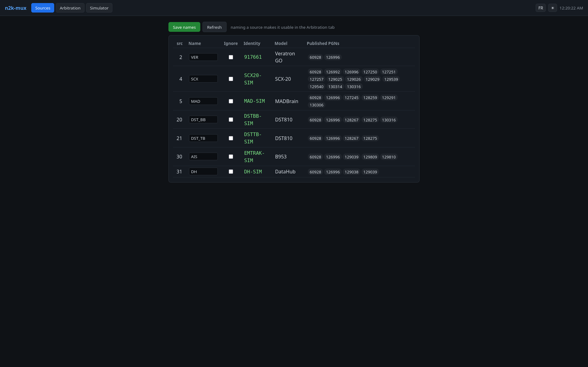
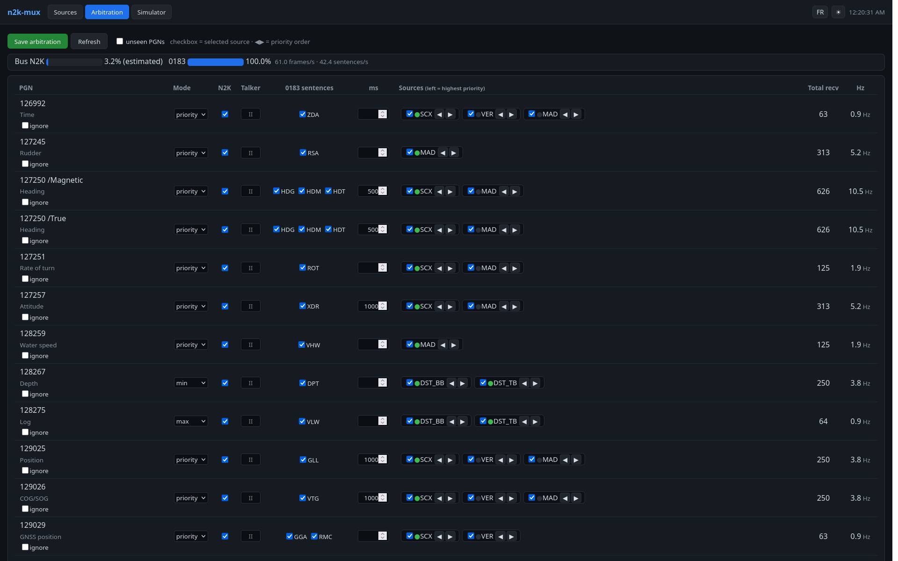

# n2k-mux — user guide

[Français](README.fr.md) · **English**

`n2k-mux` reads the boat's **NMEA 2000** network, picks **the best source** for each
piece of data (position, heading, wind, depth, AIS…) and redistributes it to your
navigation software, **in NMEA 2000** (for qtVlm) **and in NMEA 0183** (for tablets
and legacy gear).

Once installed, you get four connection points:

| You want… | Connect to | Format |
|---|---|---|
| qtVlm **on the onboard PC** (local) | **`vcan0`** interface (socketcan) | native N2K |
| qtVlm **over the network** (N2K) | `host:2700` (**TCP** NMEA source) | YDRAW |
| Tablets / qtVlm in **NMEA 0183** | `host:10110` (TCP, + UDP) | 0183 |
| **Administer** (config, devices, load, simulator) | `http://host:8080/` | Web |

> Recommended setup: an onboard PC (Linux) connected to the N2K bus through a
> **socketcan adapter** (PEAK PCAN-USB FD…). An **Actisense NGX-1/NGT-1** serial
> gateway is still supported (see [§2.4](#24-serial-gateway-variant-ngx-1)). To try
> it **without hardware**, see [§7 Test bench](#7-test-bench-without-hardware).

---

## Contents

1. [How it works](#1-how-it-works)
2. [Installation](#2-installation)
3. [Configure your boat](#3-configure-your-boat)
4. [Connect qtVlm and tablets](#4-connect-qtvlm-and-tablets)
5. [Administer from the web](#5-administer-from-the-web)
6. [Troubleshooting](#6-troubleshooting)
7. [Test bench without hardware](#7-test-bench-without-hardware)
8. [Appendix](#8-appendix) — options, converted PGNs, arbitration modes, tests

---

## 1. How it works

With a socketcan adapter (default setup):

```
NMEA 2000 bus ── CAN adapter (PEAK) ── can0
   │
   ├─► n2k-filter ──┬─► vcan0       (local N2K: qtVlm on the onboard PC)
   │  (forwards only │
   │   the retained  └─► TCP 2700   (network N2K, YDRAW: remote qtVlm)
   │   frames)
   │
   └─► candump → analyzer → n2k-mux ──► kplex ──► TCP 10110 + UDP   (0183 → tablets)
        (decodes, resolves identities,  └─► n2k-mux --ais-json → n2kd (AIS → !AIVDM)
         arbitrates, publishes "losers")
```

Key ideas:

- **Stable identity.** Devices are tracked by their serial number (*Model Serial
  Code*), not by their N2K address. Your priorities therefore survive an address
  change on the bus.
- **Per-datum arbitration.** For each kind of measurement you list the preferred
  sources; n2k-mux takes the first **live** one (automatic failover when it goes
  silent). Special modes: `min` (depth, safety), `max` (log), `fusion` (AIS
  deduplicated by MMSI).
- **N2K→N2K filter (frame passthrough).** The *decision* layer (`n2k-mux`)
  designates, per PGN, the retained source and publishes the list of **losers**;
  `n2k-filter` copies **only the retained raw frames** to `vcan0`/TCP 2700, without
  re-encoding. `vcan0` is therefore a **clean, already-arbitrated** N2K bus (a single
  GPS, a single position…) which `can0` is not.
- **Derived 0183** (kplex) for tablets and legacy gear, AIS encoded by `n2kd`.
- **Bus load measured** on the real CAN frames (not an estimate).
- **All in C11, no dependency** beyond libc (and `canboat` for decoding/AIS).

> With an NGX-1 serial gateway the principle is the same, but the input goes through
> `actisense-serial` instead of socketcan (see §2.4); the network N2K output is then
> provided by `ydraw-bridge`.

---

## 2. Installation

### 2.1 Prerequisites

- Linux, `gcc` (or `clang`), `make`.
- [canboat](https://github.com/canboat/canboat) built: `analyzer`, `n2kd`,
  `candump2analyzer` (and `actisense-serial` for a serial gateway).
- `can-utils` (`candump`) for the socketcan path: `sudo apt install can-utils`.
- `kplex` for the 0183 output — **not in the Debian / Raspberry Pi OS repos**,
  build it from source (plain C, no deps):
  `git clone https://github.com/stripydog/kplex && cd kplex && make && sudo make install`
  (installs to `/usr/bin/kplex`).
- **Either**: a **socketcan** adapter (PEAK PCAN-USB FD…) connected to the N2K bus
  (recommended) **or** an **NGX-1/NGT-1 gateway in Transfer mode** (raw N2K).

### 2.2 Build

```sh
git clone https://github.com/ozolli/n2k-mux && cd n2k-mux
make          # daemon + filter + web UI + ydraw-bridge + simulator + test harnesses
```

Check that everything is healthy — one command, one exit code (see §8.3):

```sh
make test
```

### 2.3 Install the service (socketcan, recommended)

```sh
sudo make install
```

This installs the binaries into `/usr/local/bin` (`n2k-mux`, `n2k-filter`,
`n2k-mux-web`, scripts and `ydraw-bridge`), the systemd services and example files.
Prepare the configuration:

```sh
sudo cp /etc/n2k-mux/n2k-mux.ini.example /etc/n2k-mux/n2k-mux.ini
sudo cp /etc/default/n2k-mux.example     /etc/default/n2k-mux       # settings
sudo cp kplex.conf.example               /etc/kplex.conf
$EDITOR /etc/n2k-mux/n2k-mux.ini   # see §3
```

In **`/etc/default/n2k-mux`**, set the CAN interface and the path to the canboat
binaries if they are not in the `PATH`:

```sh
CANIF=can0                 # adapter interface (brought up at 250 kbit/s by the service)
VCANIF=vcan0               # virtual CAN for the local arbitrated stream
YDRAW_PORT=2700            # arbitrated N2K stream served as YDRAW/TCP (network qtVlm)
ANALYZER=/home/you/canboat/rel/linux-x86_64/analyzer
N2KD=/home/you/canboat/rel/linux-x86_64/n2kd
CANDUMP2ANALYZER=/home/you/canboat/rel/linux-x86_64/candump2analyzer
WEB_AUTH=admin:choose-a-password   # REQUIRED: the web UI listens on the LAN
```

> **`WEB_AUTH` is mandatory** with the default service: `n2k-mux-web` listens on
> the LAN (`BIND=0.0.0.0`) and **refuses to start** without authentication, since
> the interface writes the config. Set `BIND=127.0.0.1` for local-only access
> instead (see §5).

Disable any old standalone `kplex` service (it would conflict), then start:

```sh
sudo systemctl disable --now kplex 2>/dev/null || true
sudo systemctl daemon-reload
sudo systemctl enable --now n2k-mux-can n2k-mux-web
```

The service **brings up `can0` (250 kbit/s) and `vcan0` at startup**, launches the
chain (filter + decision + kplex + n2kd), restarts itself if a link in the chain
fails (`Restart=always`) and at boot. Check:

```sh
systemctl is-active n2k-mux-can n2k-mux-web   # → active / active
journalctl -u n2k-mux-can -f                  # follow the logs
```

### 2.4 Serial gateway variant (NGX-1)

Without a socketcan adapter, use the **NGX-1/NGT-1 gateway in Transfer mode** and
the **`n2k-mux`** service (instead of `n2k-mux-can` — do not enable both). Set
`DEVICE`/`BAUD` and `ACTISENSE` in `/etc/default/n2k-mux`, then:

```sh
sudo systemctl enable --now n2k-mux n2k-mux-web
```

The chain is `actisense-serial → analyzer → n2k-mux → kplex`; the network N2K
output (TCP 2700) is provided by `ydraw-bridge` (an optional branch of the
`n2k-mux-run` script). The NGX-1 must be in **Transfer** mode (raw N2K), **not**
Convert.

### 2.5 Raspberry Pi + PiCAN (SPI CAN HAT)

A PiCAN board (SK Pang, MCP2515) presents the bus as socketcan `can0`, so the
`n2k-mux-can` chain runs unchanged. The only Pi-specific step is enabling the
device-tree overlay so the driver creates `can0`. In `/boot/firmware/config.txt`
(`/boot/config.txt` on older OSes):

```
dtparam=spi=on
dtoverlay=mcp2515-can0,oscillator=16000000,interrupt=25
```

PiCAN2 uses a **16 MHz** crystal and **GPIO25** for the interrupt (confirm against
your board). A **PiCAN FD** (MCP2518FD) uses `dtoverlay=mcp251xfd,...` instead.
Reboot, then `ip -br link show can0` should list the interface (state DOWN is fine
— the service brings it up at 250 kbit/s and creates `vcan0`). From there just
follow §2.3 (`enable --now n2k-mux-can n2k-mux-web`).

> **Termination**: the PiCAN has a 120 Ω terminator jumper. An NMEA 2000 backbone
> is already terminated at both ends — **leave the jumper off**. Enable it only if
> the Pi sits at an unterminated bus end. Power the Pi separately, not from the bus.

### 2.6 HALPI2 / integrated marine computers

The Hat Labs **HALPI2** (Raspberry Pi CM5, isolated NMEA 2000 interface) exposes
the bus directly as socketcan `can0` through its `halpi2-firmware` image — **no
device-tree overlay needed** (skip §2.5). Its CAN node is isolated and not a bus
end, so there is no termination jumper to worry about. Just install canboat +
kplex + can-utils, then `make install` and `enable --now n2k-mux-can n2k-mux-web`
as in §2.3. The same goes for any marine computer that already presents the bus
as `can0`.

---

## 3. Configure your boat

The configuration is an INI file (`/etc/n2k-mux/n2k-mux.ini`). Full commented
template: `n2k-mux.ini.example`.

```ini
[output]
talker = II                 ; talker of the 0183 sentences (qtVlm ignores it)
no_0183 = 129291            ; no VDR sentence: qtVlm rejects it (see §8.2)

[sources]
; logical name = Model Serial Code (or Unique Number) of the device
SCX = 4830123               ; Furuno SCX-20 (heading/attitude/position)
VER = 917661                ; Veratron GO (GPS)
DH  = 000A520AF6A0          ; DataHub PredictWind (AIS, sensors)

[priority]
; key = pgn[/discriminant]   |   value = [mode:] list of sources
129025          = SCX, VER            ; position: SCX first, else VER
127250/Magnetic = SCX                 ; magnetic heading
128267          = min: DST_BB, DST_TB ; depth = the shallowest (safety)
128275          = max: DST_BB, DST_TB ; log = the furthest-advanced sensor
129039          = fusion: AIS, DH     ; AIS: em-trak takes priority over DataHub

[ignore]
pgn = 262161, 262656        ; Actisense/CANboat control messages
; src = 12                  ; exclude a bus address (0 is a legal address)

[rate]
; sentence type = minimum interval in ms (throttles the 0183 output)
GLL = 1000
GSV = 5000
```

**Arbitration modes:**

| Mode | When | Effect |
|---|---|---|
| `priority` (default) | heading, position, wind… | 1st live source, auto failover |
| `min:` | depth | the smallest value (shoal safety) |
| `max:` | log (distance through water) | the furthest-advanced value (a sensor out of the water under-counts) |
| `fusion:` | AIS | all sources merged, deduplicated by MMSI |

The `/discriminant` routes on a field: `Reference` (Magnetic/True for heading,
Apparent/True for wind), `Temperature Source` (Sea/Outside).

### Finding the *Model Serial Codes* of your devices

Identities are not broadcast spontaneously: the daemon requests them from the bus
(ISO Request), which is automatic once the service is running. Let it run for a
minute, then open the **web interface** (`http://host:8080/`, **Sources** tab): each
device seen appears with its manufacturer, model and **serial**. Copy that serial
into the `[sources]` section, give it a logical name, then save (the config reloads
live, see §5).

> After naming your sources, **Save** in the web UI is enough — no need to restart
> the service.

---

## 4. Connect qtVlm and tablets

Everything happens in qtVlm under **Configuration → NMEA Connections → Incoming
tab**. Choose **a single** path for N2K (otherwise data is duplicated).

### qtVlm on the onboard PC — local N2K (`vcan0`)

In the **Incoming** tab, tick **"Direct NMEA2000 CAN bus (no gateway)"**, then
**Plugin = `socketcan`**, **Interface = `vcan0`**. Leave "Transmit boat data"
unchecked. `vcan0` is the already-**arbitrated** bus (a single source per datum) —
it is the most direct connection when qtVlm runs on the onboard PC.

> Careful: `vcan0`, **not** `can0`. `can0` is the raw, un-arbitrated bus.

### qtVlm over the network — N2K on TCP 2700

**Incoming → Network sources sub-tab → TCP frame**. On a free *Server*: **address =
IP of the onboard PC** (or its public IP if you are remote), **port = `2700`**, and
enable it. qtVlm automatically detects the **YDRAW** format and decodes N2K
(position, heading, wind, satellites, **AIS targets**…). Leave "Direct CAN bus"
unchecked in this case.

> N2K AIS and the GPS constellation require **qtVlm ≥ 5.12.27-beta2**.

### qtVlm or tablets — NMEA 0183 on 10110

Same place (**Incoming → Network sources → TCP**), a *Server* with the IP of the
onboard PC and **port = `10110`** (arbitrated instruments + AIS as already-merged
`!AIVDM`). Port 10110 is also broadcast over **UDP** on the LAN.

### Access from off the boat

Port 8080 (admin) and the data ports must not be exposed in the clear on the
Internet. Use an SSH tunnel (`ssh -L 8080:127.0.0.1:8080 host`) or a controlled
firewall/port-forward on your router.

---

## 5. Administer from the web

Open `http://host:8080/`. **Three tabs** — Sources, Arbitration and Simulator
(§7): the whole configuration is edited here, without ever touching the INI file
by hand. Two toggles at the top right:
**language** (FR/EN, initialised from the browser's) and **theme** (dark/light,
initialised from the system preference), remembered in the browser.

### Sources



The devices seen on the bus: address, **editable logical name**, **Ignore**
checkbox, stable identity, manufacturer/model and published PGNs. Naming a source
(then **Save names**) makes it usable in the Arbitration tab; this is also where you
read the serials (§3).

### Arbitration



One row per PGN. From left to right: arbitration **Mode** (priority / min / max /
fusion), **N2K** (re-emission on the arbitrated bus), 0183 **Talker**, **0183
sentences** (checkboxes — which sentences are emitted for this PGN), minimum
**interval** (ms), **Sources** seen (checked = selected, ◀▶ = priority order),
**Total recv** and **Hz**. The **load** (N2K bus measured/estimated + 0183 stream)
is at the top of the table. The **ignore** checkbox under a PGN removes it
completely. Hover the headers for help tooltips.

**Live reload.** "Save" applies the new config **without a restart**: the file is
validated, written, then the daemon receives `SIGHUP` and re-reads its config (if
the file is invalid, the old one stays active and the error is logged). The
confirmation message clears itself after 15 s. Saving **keeps your INI file as you
wrote it**: comments, section order and alignment are preserved, only the values
change. The previous version is kept as `n2k-mux.ini.bak`.

**Dead stream.** A zero rate means either "quiet bus" or "chain stopped". When
nothing has been received for more than 10 s, a red **STREAM DEAD** banner appears
at the top of the Arbitration table.

> **Security**: the web API writes the config and triggers a reload. The
> `n2k-mux-web` binary listens on `127.0.0.1` by default; the systemd service sets
> `BIND=0.0.0.0` (LAN). **Listening on anything but localhost without
> authentication is refused**: set `WEB_AUTH=user:pass` in `/etc/default/n2k-mux`
> (passed through the environment, never on the command line, which any local user
> can read). `--allow-anonymous` overrides this refusal, at your own risk. Since
> HTTP Basic is **not encrypted**, keep it on the LAN or behind an SSH tunnel / a
> TLS terminator.

---

## 6. Troubleshooting

| Symptom | Lead |
|---|---|
| **`can0` missing** | Adapter plugged in? `ip -br link show type can`. PEAK: `peak_usb` driver (kernel ≥ 6.0). The service brings `can0` up; otherwise `sudo ip link set can0 up type can bitrate 250000`. |
| **Nothing on `vcan0` / TCP 2700** | `systemctl is-active n2k-mux-can`; `ss -ltnp \| grep 2700`. In qtVlm: socketcan→`vcan0` (local) **or** TCP **client**→2700 (network), not the other way round. |
| **No AIS targets in N2K** | Requires qtVlm **≥ 5.12.27-beta2**. In 0183 (10110) AIS works regardless of version. |
| **A source appears twice on the bus** | Arbitration did not resolve the identities: check that the `[sources]` serials match the **Sources** tab. Without an identity, the filter lets everything through (*fail-open*). |
| **No 0183 sentence on 10110** | Same: unresolved identities, or kplex/n2kd down. `journalctl -u n2k-mux-can -f`. |
| **"Address already in use"** | A leftover `n2kd` (ports 2597-2602). The service cleans up at startup; otherwise `sudo pkill -x n2kd` then restart. |
| **Port 2600 collision** | `n2kd` reserves 2597-2602. N2K/YDRAW is on **2700** (configurable `YDRAW_PORT`), definitely not 2600. |
| **`n2k-mux-web` won't start** | `journalctl -u n2k-mux-web`: non-local `BIND` without `WEB_AUTH` is refused (§5). |
| **"STREAM DEAD" banner** | The chain receives nothing: `systemctl is-active n2k-mux-can` (or `n2k-mux-sim` in simulator mode), then its journal. |
| **qtVlm: "Unrecognized or wrong message $IIVDR"** | qtVlm does not know VDR. Add `no_0183 = 129291` under `[output]` (already in the shipped examples). |
| **Nothing after unticking "Simulator running"** | The real chain is started by `n2k-mux-switch real`: it needs `n2k-mux-can` or `n2k-mux` to be **enabled**, or `REAL_UNIT` set (§7). |
| **The web config won't save** | `/etc/n2k-mux/n2k-mux.ini` must be writable by the web service's user (root by default → OK). |
| **NGX-1: nothing** | **Transfer** mode (not Convert), correct `DEVICE`/`BAUD` in `/etc/default/n2k-mux`. |

Raw bus sniff (harmless): `candump can0` (`can-utils` package).

---

## 7. Test bench without hardware

The `n2k-sim` simulator produces a coherent N2K stream (a boat moving, current,
wind, AIS targets) for **every PGN n2k-mux understands**, with no bus or adapter.
Its companion config `n2k-sim.ini` carries the simulated identities, so
arbitration resolves right away.

### 7.1 Simulated chain and switching

`n2k-mux-sim.service` runs the **same downstream chain** as the real ones
(arbitration, AIS through n2kd, kplex on **10110**, N2K YDRAW on **2700**, web UI),
fed by the simulator instead of the bus. qtVlm keeps its connections unchanged.
The simulator emits the 0183 JSON and the N2K frames from **one boat state**, so
both outputs always agree. The simulated chain and the real ones are **mutually
exclusive**: starting one stops the other.

```sh
sudo n2k-mux-switch sim      # simulated chain (stops the real one)
sudo n2k-mux-switch real     # back to the real network (stops the simulator)
n2k-mux-switch status        # sim | real | none
```

`real` starts `REAL_UNIT` if set in `/etc/default/n2k-mux`, otherwise whichever
of `n2k-mux-can` / `n2k-mux` is **enabled**. The **"Simulator running"** toggle of
the web UI does exactly the same, and shows which chain is really running.
**At boot, the real chain always starts** (`n2k-mux-sim` is never enabled).

The simulated chain arbitrates with its own `/etc/n2k-mux/n2k-sim.ini` (installed
if absent, never overwritten). The real bus is **not** read in simulator mode.

### 7.2 Simulator tab

Six **inputs**, as the crew experiences them: true heading (**HDG**), speed
through water (**STW**), current direction and speed (**set**, **drift**), true
wind direction and speed (**TWD**, **TWS**). Each has a slider, a number field and
an **auto** box (slow variation around the last value set, without a jump).

Everything else is **derived** and shown in the *Derived values* table: course
and speed over ground (COG, SOG = water vector + current), **TWA** = TWD − HDG,
apparent wind (**AWA**, **AWS**), true wind relative to the water, rate of turn,
position. Angles to the bow read 0–180° with the side (port/starboard).

- **Random wind** — the wind changes in **sequences** (about 10 minutes by default):
  a random target within the total amplitude (speed 0–20 %, direction in degrees),
  a faster or slower transition, then a plateau. TWD/TWS become the base.
- **Polar** — pick a `.pol` or `.csv` polar from qtVlm's folder (`POLAR_DIR`,
  default `$HOME/.qtVlm/polar`; set it, since the service runs as root) and let
  **STW come from the polar**: bilinear interpolation on the water TWA/TWS, clamped
  to the table, never extrapolated.
- **Heel** follows the apparent wind (to leeward, up to 7°) and stays steady when
  the wind does.

> The simulated boat has **no leeway**. If your navigation software estimates
> leeway from heel, set its leeway coefficient to **0** while simulating, or it will
> compute a current that does not exist.

### 7.3 By hand

```sh
./n2k-sim | ./n2k-mux n2k-sim.ini -v          # instruments → 0183 sentences
./n2k-sim --once | ./n2k-mux n2k-sim.ini      # one of each PGN then exit
./n2k-sim | ./n2k-mux --ais-json n2k-sim.ini  # AIS → dedup by MMSI
./n2k-sim --actisense | ./ydraw-bridge --port 2700   # N2K to qtVlm: TCP → host:2700
```

The control file is plain `key = value`, re-read as soon as it changes — the web UI
writes exactly this:

```ini
hdg = 45          ; true heading, degrees   (auto = slow variation)
stw = 6.0         ; speed through water, knots
set = 120         ; current direction (towards), degrees
drift = 1.0       ; current speed, knots
twd = auto 225    ; true wind direction (from), varying around 225
tws = 20          ; true wind speed, knots
wind_random = 1   ; tws_var (%), twd_var (°), wind_period (min), seed
stw_polar = 1     ; STW from the polar below
polar = /home/you/.qtVlm/polar/CM50.pol
```

```sh
./n2k-sim --control sim.ctl --state sim.state | ./n2k-mux n2k-sim.ini
./n2k-sim --control sim.ctl --wind-trace 3600    # 1 h of simulated wind, instantly
```

**Full 0183 chain without hardware or service** — `./n2k-sim-run` wires up
`n2k-sim → n2k-mux (+ --ais-json → n2kd) → kplex` and exposes qtVlm on **TCP 10110**.

> The socketcan filter can also be tested on virtual CANs (`vcan`): inject frames
> with `cansend`, read the output on a second `vcan`.

---

## 8. Appendix

### 8.1 Binary options

**`n2k-mux`** (decision / conversion):

```
n2k-mux [config.ini] [--tx PATH | --tx-can IFACE] [--src-addr N] [--tx-interval SEC]
                     [--sources PATH] [--stats PATH] [--losers PATH]
                     [--no-0183] [--ais-json] [-v]
```

| Option | Role |
|---|---|
| `--tx PATH` | ISO Request on a FIFO (to `actisense-serial`, serial path) |
| `--tx-can IFACE` | ISO Request over **socketcan** on IFACE (writes `can_frame`s) |
| `--src-addr N` | source address of the socketcan ISO Requests (default 0) |
| `--sources PATH` | publishes the devices seen as JSON (web UI) |
| `--stats PATH` | publishes per-PGN rate + bus load (measured if socketcan) |
| `--losers PATH` | publishes the arbitration `(pgn src)` losers (for `n2k-filter`) |
| `--no-0183` | disables the 0183 output (arbitration only) |
| `--ais-json` | AIS filter mode (deduplicated JSON→JSON) in front of `n2kd` |
| `-v` | logs the decisions + a summary on stderr |

**`n2k-filter`** (N2K→N2K socketcan filter):

```
n2k-filter [--in IFACE] [--out IFACE] [--drop FILE] [--ydraw-port N] [-v]
```
`--in` real bus (def. can0), `--out` arbitrated bus (def. vcan0), `--drop` the
losers list published by `n2k-mux --losers`, `--ydraw-port` also serves the
arbitrated stream as YDRAW/TCP (network qtVlm).

**`n2k-mux-web`** (web UI):

```
n2k-mux-web [config.ini] [--sources P] [--stats P] [--busmap P] [--port N] [--bind ADDR]
            [--reload-cmd CMD] [--auth user:pass] [--allow-anonymous]
            [--sim-control P] [--sim-state P] [--polar-dir D] [--sim-start CMD] [--sim-stop CMD]
```

Defaults: port 8080, bind `127.0.0.1`. `--auth` (or `N2K_MUX_WEB_AUTH` in the
environment) enables HTTP Basic authentication; a non-local `--bind` without it is
refused unless `--allow-anonymous`. `--sim-control` (default `/etc/n2k-mux/sim.ctl`)
and `--sim-state` (default `/run/n2k-mux/sim.state`) are the simulator's control and
derived-state files, `--polar-dir` the polar folder. `--sim-start` / `--sim-stop` are
the switch commands (the service passes `n2k-mux-switch sim` / `real`; set
`SIM_START=` and `SIM_STOP=` empty to make the toggle only mute the simulator).

**`n2k-sim`** (simulator): `--once`, `--duration SEC`, `--no-ais`, `--tick MS`
(default 50), `--actisense` (N2K frames instead of JSON), `--control FILE` (live
inputs), `--state FILE` (derived values, twice a second), `--actisense-out FILE`
(N2K frames **in addition** to the JSON, same boat state), `--wind-trace SEC`
(prints `t;twd;tws;stw` of simulated time without waiting).

**`n2k-mux-switch`**: `sim | real | status` (§7.1).

### 8.2 Converted data (N2K → 0183)

| PGN | Datum | 0183 sentences |
|---|---|---|
| 129025 | Position | GLL |
| 129026 | COG/SOG | VTG |
| 129029 | GNSS position | GGA + RMC (RMC takes COG/SOG from 129026, variation from 127250) |
| 129539 | DOP / fix mode | GSA |
| 129540 | Satellites in view | GSV (paged) |
| 126992 | System time | ZDA |
| 127250 | Heading | HDG + HDM (mag) / HDT (true) |
| 127251 | Rate of turn | ROT |
| 127257 | Attitude | XDR (pitch/roll) |
| 130306 | Wind | MWV(R) apparent · MWV(T) true (boat/water referenced) · MWD (ground referenced to North) |
| 127245 | Rudder | RSA |
| 129291 | Current (set/drift) | VDR — off in the shipped configs (`no_0183 = 129291`): qtVlm rejects it |
| 128259 | Water speed | VHW |
| 128267 | Depth | DPT (min of the sounders) |
| 128275 | Distance through water (log) | VLW (max of the sounders) |
| 130316 | Temperature | MTW (water) / MDA (air) — 130312 deprecated, accepted as input |
| 130314 | Pressure | MDA |
| 129038/39/40/41, 129793/94/95/96/97/98, 129801/02, 129809/810 | AIS | !AIVDM (via n2kd) |

> In N2K (vcan0 / TCP 2700) the frames pass through unchanged (no conversion); the
> table above concerns only the **0183** output (kplex/10110).

### 8.3 Tests

```sh
make test     # everything, one exit code
make debug    # rebuilds with sanitizers (UB + memory) and reruns the suite
```

`make test` runs, in order: each module's harness (`test_jsonl`, `test_registry`,
`test_nmea0183`, `test_config`, `test_arbiter`, `test_mapper`, `test_aisdedup`,
`test_sources`, `test_stats`, `test_netout`, `test_ydraw`, `test_inimerge`,
`test_polar`); the parser on **every capture in `samples/*.jsonl`**; an end-to-end
`n2k-sim | n2k-mux` checking the **checksum of every sentence**; then the simulator
(derived values, random wind, polar, N2K frames, cadence) and the web API (simulator
settings, polars, switching, JS syntax). Dropping a real capture (`analyzer -json
-nv`) into `samples/` adds it to the suite — mind that the repository is public.
`make debug` catches faults invisible at `-O2`; `make clean && make` to go back.

---

## License

Distributed under the **Apache 2.0** license — see [`LICENSE`](LICENSE).
© 2026 Olivier Zolli.

n2k-mux **does not include canboat code**: it consumes the output of `analyzer` and
delegates AIS to `n2kd` (a separate process). canboat is also under Apache 2.0.
