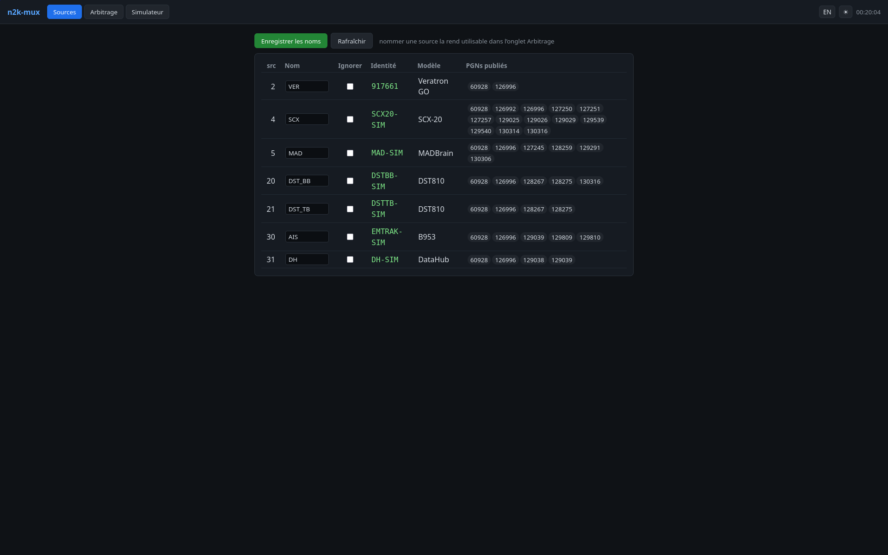

# n2k-mux — mode d'emploi

`n2k-mux` lit le réseau **NMEA 2000** du bord, choisit **la meilleure source**
pour chaque donnée (position, cap, vent, profondeur, AIS…) et la redistribue à vos
logiciels de navigation, **en NMEA 2000** (pour qtVlm) **et en NMEA 0183** (pour
les tablettes et le legacy).

Une fois installé, vous disposez de quatre points de connexion :

| Vous voulez… | Connectez-vous à | Format |
|---|---|---|
| qtVlm **sur le PC de bord** (local) | interface **`vcan0`** (socketcan) | N2K natif |
| qtVlm **en réseau** (N2K) | `hôte:2700` (source NMEA **TCP**) | YDRAW |
| Tablettes / qtVlm en **NMEA 0183** | `hôte:10110` (TCP, + UDP) | 0183 |
| **Administrer** (config, équipements, charge) | `http://hôte:8080/` | Web |

> Montage recommandé : PC de bord (Linux) relié au bus N2K par un **adaptateur
> socketcan** (PEAK PCAN-USB FD…). Une passerelle série **Actisense NGX-1/NGT-1**
> reste supportée (voir [§2.4](#24-variante-passerelle-série-ngx-1)). Pour essayer
> **sans matériel**, voir le [§7 Banc de test](#7-banc-de-test-sans-matériel).

---

## Sommaire

1. [Comment ça marche](#1-comment-ça-marche)
2. [Installation](#2-installation)
3. [Configurer votre bord](#3-configurer-votre-bord)
4. [Brancher qtVlm et les tablettes](#4-brancher-qtvlm-et-les-tablettes)
5. [Administrer par le web](#5-administrer-par-le-web)
6. [Dépannage](#6-dépannage)
7. [Banc de test sans matériel](#7-banc-de-test-sans-matériel)
8. [Annexes](#8-annexes) — options, PGN convertis, modes d'arbitrage, tests

---

## 1. Comment ça marche

Avec un adaptateur socketcan (montage par défaut) :

```
Bus NMEA 2000 ── adaptateur CAN (PEAK) ── can0
   │
   ├─► n2k-filter ──┬─► vcan0       (N2K local : qtVlm sur le PC de bord)
   │  (ne réémet que │
   │   les trames    └─► TCP 2700   (N2K réseau YDRAW : qtVlm distant)
   │   retenues)
   │
   └─► candump → analyzer → n2k-mux ──► kplex ──► TCP 10110 + UDP   (0183 → tablettes)
        (décode, résout les identités,  └─► n2k-mux --ais-json → n2kd (AIS → !AIVDM)
         arbitre, publie les « perdants »)
```

Les idées clés :

- **Identité stable.** Les équipements sont suivis par leur numéro de série
  (*Model Serial Code*), pas par leur adresse N2K. Vos priorités survivent donc à
  un changement d'adresse sur le bus.
- **Arbitrage par donnée.** Pour chaque type de mesure vous listez les sources
  préférées ; n2k-mux prend la première **vivante** (bascule automatique si elle se
  tait). Modes spéciaux : `min` (profondeur, sécurité), `max` (loch), `fusion`
  (AIS dédupliqué par MMSI).
- **Filtre N2K→N2K (frame-passthrough).** La couche *décision* (`n2k-mux`) désigne,
  par PGN, la source retenue et publie la liste des **perdants** ; `n2k-filter`
  recopie sur `vcan0`/TCP 2700 **uniquement les trames brutes retenues**, sans
  ré-encodage. `vcan0` est donc un bus N2K **propre, déjà arbitré** (un seul GPS,
  une seule position…) que `can0` n'est pas.
- **0183 dérivé** (kplex) pour les tablettes et le legacy, AIS encodé par `n2kd`.
- **Charge du bus mesurée** sur les vraies trames CAN (pas une estimation).
- **Tout en C11, sans dépendance** hors libc (et `canboat` pour le décodage/AIS).

> Avec une passerelle série NGX-1, le principe est le même mais l'entrée passe par
> `actisense-serial` au lieu de socketcan (cf. §2.4) ; la sortie N2K réseau est
> alors fournie par `ydraw-bridge`.

---

## 2. Installation

### 2.1 Prérequis

- Linux, `gcc` (ou `clang`), `make`.
- [canboat](https://github.com/canboat/canboat) compilé : `analyzer`, `n2kd`,
  `candump2analyzer` (et `actisense-serial` si passerelle série).
- `can-utils` (`candump`) pour la voie socketcan : `sudo apt install can-utils`.
- `kplex` (paquet de la distribution) pour la sortie 0183.
- **Au choix** : un adaptateur **socketcan** (PEAK PCAN-USB FD…) relié au bus N2K
  (recommandé) **ou** une passerelle **NGX-1/NGT-1 en mode Transfer** (N2K brut).

### 2.2 Compiler

```sh
git clone https://github.com/ozolli/n2k-mux && cd n2k-mux
make          # daemon + filtre + UI web + ydraw-bridge + simulateur + testeurs
```

Vérifier que tout est sain (tous les testeurs à 0 échec) :

```sh
for t in test_config test_mapper test_arbiter test_nmea0183 test_aisdedup \
         test_sources test_stats test_netout test_ydraw; do ./$t && echo "$t OK"; done
./test_jsonl --selftest
```

### 2.3 Installer le service (socketcan, recommandé)

```sh
sudo make install
```

Cela installe les binaires dans `/usr/local/bin` (`n2k-mux`, `n2k-filter`,
`n2k-mux-web`, scripts et `ydraw-bridge`), les services systemd et des fichiers
d'exemple. Préparez la configuration :

```sh
sudo cp /etc/n2k-mux/n2k-mux.ini.example /etc/n2k-mux/n2k-mux.ini
sudo cp /etc/default/n2k-mux.example     /etc/default/n2k-mux       # réglages
sudo cp kplex.conf.example               /etc/kplex.conf
$EDITOR /etc/n2k-mux/n2k-mux.ini   # voir §3
```

Dans **`/etc/default/n2k-mux`**, indiquez l'interface CAN et le chemin des binaires
canboat s'ils ne sont pas dans le `PATH` :

```sh
CANIF=can0                 # interface de l'adaptateur (montée à 250 kbit/s par le service)
VCANIF=vcan0               # CAN virtuel pour le flux arbitré local
YDRAW_PORT=2700            # flux N2K arbitré servi en YDRAW/TCP (qtVlm réseau)
ANALYZER=/home/vous/canboat/rel/linux-x86_64/analyzer
N2KD=/home/vous/canboat/rel/linux-x86_64/n2kd
CANDUMP2ANALYZER=/home/vous/canboat/rel/linux-x86_64/candump2analyzer
```

Désactivez un éventuel ancien service `kplex` autonome (il entrerait en conflit),
puis démarrez :

```sh
sudo systemctl disable --now kplex 2>/dev/null || true
sudo systemctl daemon-reload
sudo systemctl enable --now n2k-mux-can n2k-mux-web
```

Le service **monte `can0` (250 kbit/s) et `vcan0` au démarrage**, lance la chaîne
(filtre + décision + kplex + n2kd), redémarre tout seul en cas de défaillance d'un
maillon (`Restart=always`) et au boot. Vérifier :

```sh
systemctl is-active n2k-mux-can n2k-mux-web   # → active / active
journalctl -u n2k-mux-can -f                  # suivre les logs
```

### 2.4 Variante passerelle série (NGX-1)

Sans adaptateur socketcan, utilisez la passerelle **NGX-1/NGT-1 en mode Transfer**
et le service **`n2k-mux`** (au lieu de `n2k-mux-can` — ne pas activer les deux).
Réglez `DEVICE`/`BAUD` et `ACTISENSE` dans `/etc/default/n2k-mux`, puis :

```sh
sudo systemctl enable --now n2k-mux n2k-mux-web
```

La chaîne est `actisense-serial → analyzer → n2k-mux → kplex` ; la sortie N2K
réseau (TCP 2700) est fournie par `ydraw-bridge` (branche optionnelle du script
`n2k-mux-run`). Le NGX-1 doit être en mode **Transfer** (N2K brut), **pas** Convert.

---

## 3. Configurer votre bord

La configuration est un fichier INI (`/etc/n2k-mux/n2k-mux.ini`). Modèle complet
commenté : `n2k-mux.ini.example`.

```ini
[output]
talker = II                 ; talker des phrases 0183 (qtVlm l'ignore)

[sources]
; nom logique = Model Serial Code (ou Unique Number) de l'équipement
SCX = 4830123               ; Furuno SCX-20 (cap/attitude/position)
VER = 917661                ; Veratron GO (GPS)
DH  = 000A520AF6A0          ; DataHub PredictWind (AIS, capteurs)

[priority]
; clé = pgn[/discriminant]   |   valeur = [mode:] liste de sources
129025          = SCX, VER            ; position : SCX d'abord, sinon VER
127250/Magnetic = SCX                 ; cap magnétique
128267          = min: DST_BB, DST_TB ; profondeur = la plus faible (sécurité)
128275          = max: DST_BB, DST_TB ; loch = le capteur le plus avancé
129039          = fusion: AIS, DH     ; AIS : em-trak prioritaire sur DataHub

[ignore]
src = 0                     ; ignorer l'adresse 0
pgn = 262161, 262656        ; messages de contrôle Actisense/CANboat

[rate]
; type de phrase = intervalle minimum en ms (limite le débit 0183)
GLL = 1000
GSV = 5000
```

**Les modes d'arbitrage :**

| Mode | Quand | Effet |
|---|---|---|
| `priority` (défaut) | cap, position, vent… | 1ʳᵉ source vivante, bascule auto |
| `min:` | profondeur | la valeur la plus faible (sécurité haut-fond) |
| `max:` | loch (distance dans l'eau) | la valeur la plus avancée (capteur hors d'eau sous-compte) |
| `fusion:` | AIS | toutes les sources fusionnées, dédup par MMSI |

Le `/discriminant` route selon un champ : `Reference` (Magnetic/True pour le cap,
Apparent/True pour le vent), `Temperature Source` (Sea/Outside).

### Trouver les *Model Serial Code* de vos équipements

Les identités ne circulent pas spontanément : le daemon les réclame au bus (ISO
Request), c'est automatique une fois le service lancé. Laissez tourner une minute,
puis ouvrez l'**interface web** (`http://hôte:8080/`, onglet **Sources**) : chaque
équipement vu y figure avec son fabricant, son modèle et son **serial**. Reportez
ce serial dans la section `[sources]`, donnez-lui un nom logique, puis enregistrez
(la config se recharge à chaud, voir §5).

> Après avoir nommé vos sources, **Enregistrer** dans le web suffit — pas besoin de
> redémarrer le service.

---

## 4. Brancher qtVlm et les tablettes

Tout se passe dans qtVlm sous **Configuration → Connexions NMEA → onglet
Entrants**. Choisir **une seule** voie pour le N2K (sinon données dupliquées).

### qtVlm sur le PC de bord — N2K local (`vcan0`)

Dans l'onglet **Entrants**, cocher **« Bus CAN direct NMEA2000 (sans passerelle) »**,
puis **Plugin = `socketcan`**, **Interface = `vcan0`**. Laisser « Émettre données
bateau » décoché. `vcan0` est le bus déjà **arbitré** (une seule source par donnée) —
c'est le branchement le plus direct quand qtVlm tourne sur le PC de bord.

> Attention : `vcan0`, **pas** `can0`. `can0` est le bus brut non arbitré.

### qtVlm en réseau — N2K sur TCP 2700

Onglet **Entrants → sous-onglet Sources réseau → cadre TCP**. Sur un *Serveur*
libre : **adresse = IP du PC de bord** (ou son IP publique si vous êtes à
distance), **port = `2700`**, et activez-le. qtVlm détecte automatiquement le
format **YDRAW** et décode le N2K (position, cap, vent, satellites, **cibles AIS**…).
Laisser le « Bus CAN direct » décoché dans ce cas.

> Le N2K AIS et la constellation GPS nécessitent **qtVlm ≥ 5.12.27-beta2**.

### qtVlm ou tablettes — NMEA 0183 sur 10110

Même endroit (**Entrants → Sources réseau → TCP**), un *Serveur* avec l'IP du PC de
bord et **port = `10110`** (instruments arbitrés + AIS en `!AIVDM` déjà fusionnés).
Le 10110 est aussi diffusé en **UDP** sur le LAN.

### Accès depuis l'extérieur du bateau

Le 8080 (admin) et les ports de données ne doivent pas être exposés en clair sur
Internet. Passez par un tunnel SSH (`ssh -L 8080:127.0.0.1:8080 hôte`) ou un
pare-feu/redirection maîtrisé sur votre box.

---

## 5. Administrer par le web

Ouvrez `http://hôte:8080/`. **Deux onglets** : toute la configuration s'édite ici,
sans jamais toucher au fichier INI à la main. Deux bascules en haut à droite :
**langue** (FR/EN, initialisée d'après celle du navigateur) et **thème**
(sombre/clair), mémorisées dans le navigateur.

### Sources



Les équipements vus sur le bus : adresse, **nom logique éditable**, case
**Ignorer**, identité stable, fabricant/modèle et PGN publiés. Nommer une source
(puis **Enregistrer les noms**) la rend utilisable dans l'onglet Arbitrage ; c'est
aussi ici qu'on relève les serials (§3).

### Arbitrage


Une ligne par PGN. De gauche à droite : **Mode** d'arbitrage (priority / min / max
/ fusion), **N2K** (réémission sur le bus arbitré), **Talker** 0183, **Phrases
0183** (cases à cocher — choix des phrases émises pour ce PGN), **intervalle**
minimum (ms), **Sources** vues (cochées = retenues, ◀▶ = ordre de priorité),
**Total reçu** et **Hz**. La **charge** (bus N2K mesurée/estimée + flux 0183) est
en tête de tableau. La case **ignorer** sous un PGN le retire complètement. Les
en-têtes portent une info-bulle d'aide au survol.

**Reload à chaud.** « Enregistrer » applique la nouvelle config **sans
redémarrage** : le fichier est validé, écrit, puis le daemon reçoit `SIGHUP` et
relit sa config (si le fichier est invalide, l'ancienne reste active et l'erreur
est journalisée). Le message de confirmation s'efface seul après 15 s.

> **Sécurité** : l'API web écrit la config et déclenche un rechargement. Le
> service écoute par défaut sur le LAN (`0.0.0.0:8080`) ; réservez-le à un réseau
> de confiance et ajoutez une authentification avant toute exposition plus large.

---

## 6. Dépannage

| Symptôme | Piste |
|---|---|
| **`can0` absent** | Adaptateur branché ? `ip -br link show type can`. PEAK : pilote `peak_usb` (noyau ≥ 6.0). Le service monte `can0` ; sinon `sudo ip link set can0 up type can bitrate 250000`. |
| **Rien sur `vcan0` / TCP 2700** | `systemctl is-active n2k-mux-can` ; `ss -ltnp \| grep 2700`. Dans qtVlm : socketcan→`vcan0` (local) **ou** TCP **client**→2700 (réseau), pas l'inverse. |
| **Pas de cibles AIS en N2K** | Nécessite qtVlm **≥ 5.12.27-beta2**. En 0183 (10110) l'AIS passe quelle que soit la version. |
| **Une source en double sur le bus** | L'arbitrage n'a pas résolu les identités : vérifier que les serials de `[sources]` correspondent à l'onglet **Sources**. Sans identité, le filtre laisse tout passer (*fail-open*). |
| **Aucune phrase 0183 sur 10110** | Idem : identités non résolues, ou kplex/n2kd down. `journalctl -u n2k-mux-can -f`. |
| **« Address already in use »** | Un `n2kd` résiduel (ports 2597-2602). Le service fait le ménage au démarrage ; sinon `sudo pkill -x n2kd` puis restart. |
| **Collision port 2600** | `n2kd` réquisitionne 2597-2602. Le N2K/YDRAW est sur **2700** (réglable `YDRAW_PORT`), surtout pas 2600. |
| **La config web ne s'enregistre pas** | `/etc/n2k-mux/n2k-mux.ini` doit être inscriptible par l'utilisateur du service web (root par défaut → OK). |
| **NGX-1 : rien** | Mode **Transfer** (pas Convert), `DEVICE`/`BAUD` corrects dans `/etc/default/n2k-mux`. |

Sniff brut du bus (sans rien casser) : `candump can0` (paquet `can-utils`).

---

## 7. Banc de test sans matériel

Le simulateur `n2k-sim` rejoue un flux N2K cohérent (bateau qui avance, cap qui
infléchit la route, cibles AIS) pour **tous les PGN compris**, sans bus ni
adaptateur. La config compagnon `n2k-sim.ini` porte les identités simulées →
arbitrage résolu d'emblée.

```sh
./n2k-sim | ./n2k-mux n2k-sim.ini -v          # instruments → phrases 0183
./n2k-sim --once | ./n2k-mux n2k-sim.ini      # un de chaque PGN puis fin
./n2k-sim | ./n2k-mux --ais-json n2k-sim.ini  # AIS → dédup par MMSI
```

Options : `--once`, `--duration SEC`, `--no-ais`, `--tick MS`, `--actisense`.

**Chaîne 0183 complète sans matériel** — `./n2k-sim-run` monte
`n2k-sim → n2k-mux (+ --ais-json → n2kd) → kplex` et expose qtVlm sur **TCP 10110**.

**N2K vers qtVlm sans matériel** — le mode `--actisense` encode les PGN (AIS
compris) en trames N2K, servies en YDRAW par `ydraw-bridge` :

```sh
./n2k-sim --actisense | ./ydraw-bridge --port 2700   # qtVlm : TCP → hôte:2700
```

> Le filtre socketcan se teste aussi sur des CAN virtuels (`vcan`) : injecter des
> trames avec `cansend`, lire la sortie sur un second `vcan`.

---

## 8. Annexes

### 8.1 Options des binaires

**`n2k-mux`** (décision / conversion) :

```
n2k-mux [config.ini] [--tx CHEMIN | --tx-can IFACE] [--src-addr N] [--tx-interval SEC]
                     [--sources CHEMIN] [--stats CHEMIN] [--losers CHEMIN]
                     [--no-0183] [--ais-json] [-v]
```

| Option | Rôle |
|---|---|
| `--tx CHEMIN` | ISO Request sur un FIFO (vers `actisense-serial`, voie série) |
| `--tx-can IFACE` | ISO Request en **socketcan** sur IFACE (écrit des `can_frame`) |
| `--src-addr N` | adresse source des ISO Request socketcan (défaut 0) |
| `--sources CHEMIN` | publie les équipements vus en JSON (UI web) |
| `--stats CHEMIN` | publie débit/PGN + charge de bus (mesurée si socketcan) |
| `--losers CHEMIN` | publie les `(pgn src)` perdants de l'arbitrage (pour `n2k-filter`) |
| `--no-0183` | désactive la sortie 0183 (arbitrage seul) |
| `--ais-json` | mode filtre AIS (JSON→JSON dédupliqué) devant `n2kd` |
| `-v` | journalise les décisions + un résumé sur stderr |

**`n2k-filter`** (filtre N2K→N2K socketcan) :

```
n2k-filter [--in IFACE] [--out IFACE] [--drop FICHIER] [--ydraw-port N] [-v]
```
`--in` bus réel (déf. can0), `--out` bus arbitré (déf. vcan0), `--drop` liste des
perdants publiée par `n2k-mux --losers`, `--ydraw-port` sert aussi le flux arbitré
en YDRAW/TCP (qtVlm réseau).

**`n2k-mux-web`** : `[config.ini] [--sources P] [--stats P] [--port N]
[--bind ADDR] [--reload-cmd CMD]` (défauts : port 8080, bind `0.0.0.0`).

### 8.2 Données converties (N2K → 0183)

| PGN | Donnée | Phrases 0183 |
|---|---|---|
| 129025 | Position | GLL |
| 129026 | COG/SOG | VTG |
| 129029 | Position GNSS | GGA |
| 129539 | DOP / mode de fix | GSA |
| 129540 | Satellites en vue | GSV (paginé) |
| 126992 | Heure système | ZDA |
| 127250 | Cap | HDG + HDM (mag) / HDT (vrai) |
| 127251 | Taux de giration | ROT |
| 127257 | Attitude | XDR (pitch/roll) |
| 130306 | Vent | MWV(R) / MWV(T) + MWD |
| 127245 | Barre | RSA |
| 129291 | Courant (set/drift) | VDR |
| 128259 | Vitesse surface | VHW |
| 128267 | Profondeur | DPT (min des sondeurs) |
| 128275 | Distance dans l'eau (loch) | VLW (max des sondeurs) |
| 130316 | Température | MTW (eau) / MDA (air) — 130312 déprécié, accepté en entrée |
| 130314 | Pression | MDA |
| 129038/39/40/41, 129793/94/95/96/97/98, 129801/02, 129809/810 | AIS | !AIVDM (via n2kd) |

> En N2K (vcan0 / TCP 2700) les trames passent telles quelles (pas de conversion) ;
> la table ci-dessus ne concerne que la sortie **0183** (kplex/10110).

### 8.3 Tests

Chaque module a son testeur autonome (`test_jsonl`, `test_registry`,
`test_nmea0183`, `test_config`, `test_arbiter`, `test_mapper`, `test_aisdedup`,
`test_sources`, `test_stats`, `test_netout`, `test_ydraw`). `./test_jsonl
--selftest` vérifie le typage des champs du parser sans entrée.

---

## Licence

Distribué sous licence **Apache 2.0** — voir [`LICENSE`](LICENSE).
© 2026 Olivier Zolli.

n2k-mux **n'inclut pas de code de canboat** : il consomme la sortie de
l'`analyzer` et délègue l'AIS à `n2kd` (process séparé). canboat est lui aussi
sous Apache 2.0.
